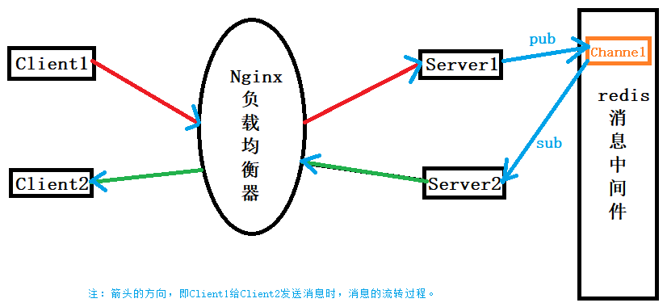

# ChatServer-based-on-NginxTcpLoadBalance-RedisPubSub
A cluster chat server based on Ngnix TCP load balancing and Redis publish subscriptions.


# 项目编译和安装：

## 编译：

使用CMakeLists.txt文件，在Linux上简单和可重复的方式来构建C++项目。

```shell
# 在项目根目录中创建一个名为 build 的目录，并在其中运行 CMake 工具。
su root 
#mkdir build
cd ./build
rm -rf *   # 删除上一次编译产生的build中的各种文件
cmake ..

# 在 build 目录中运行您生成的构建系统来构建项目
make
```


本项目，将上述操作写入了一个脚本文件`autobuild.sh`：

```shell
#!/bin/bash

# 打开了调试模式。当脚本执行时，每个命令都会打印出来。
set -x

rm -rf `pwd`/build/*
rm -rf `pwd`/bin/ChatServer `pwd`/bin/ChatClient
cd `pwd`/build &&
	cmake .. &&
	make
```

```shell
# 项目的编译过程简化为：
su root
./autobuild.sh
```

## 项目代码的运行：

前提需要先启动`redis`和`nginx`服务器。

```shell
redis-server /myredis/redis.conf

cd /usr/local/nginx/sbin/
./nginx

# 查看redis和nginx、mysql是否已启动
netstat -antp
```

写了一个服务端`ChatServer.cpp`和客户端程序`ChatClient.cpp`，编译后会在`/bin`目录下生成两个可执行文件`ChatClient`和`ChatServer`，运行即可。

