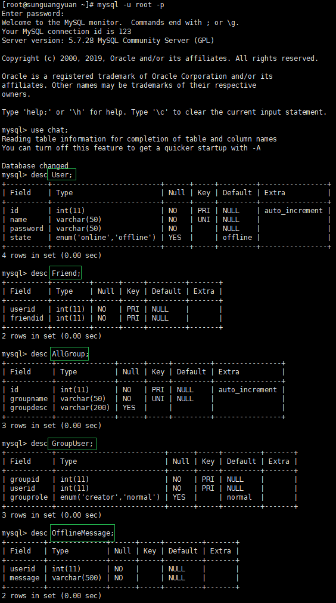
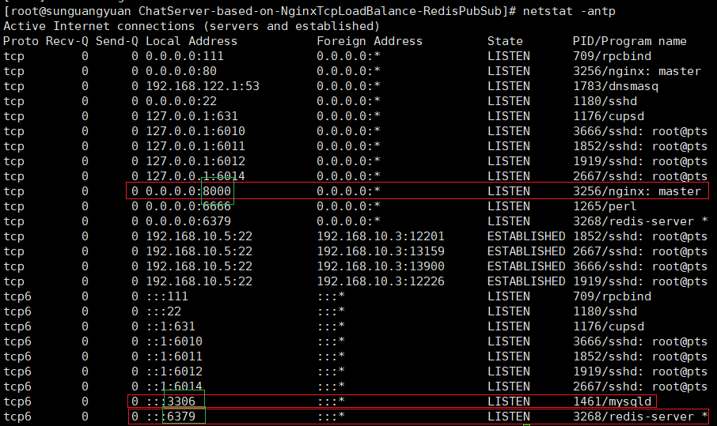
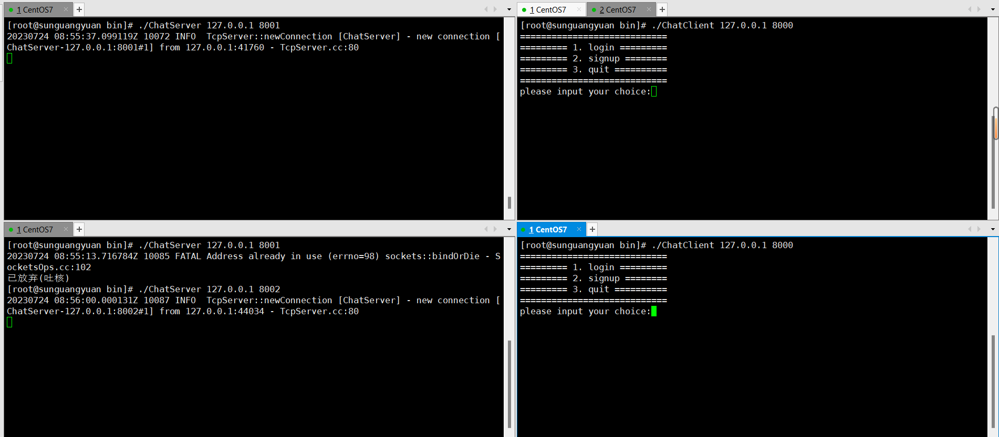

# ChatServer-based-on-NginxTcpLoadBalance-RedisPubSub
A cluster chat server based on Ngnix TCP load balancing and Redis publish subscriptions.

[CSDN详细的万字分析和说明。](https://blog.csdn.net/qq_44599368/article/details/131929941?spm=1001.2014.3001.5501)

# 项目内容：

## 技术栈：

Json序列化和反序列化、muduo网络库开发、nginx（源码编译安装和环境部署、tcp负载均衡器配置）、redis（redis缓存服务器编程实践、基于发布-订阅的服务器中间件redis消息队列编程实现跨服务器通信）、MySQL数据库编程、CMake构建编译环境、聊天功能的基本实现。

## 项目需求：

1. 客户端新用户注册
2. 客户端用户登录
3. 添加好友和添加群组
4. 好友聊天
5. 群组聊天
6. 离线消息
7. nginx配置tcp负载均衡
8. redis支持的客户端跨服务器通信
<p align="center">
  
</p>
## 项目目标：

1. 掌握服务器的网络I/O模块，业务模块，数据模块分层的设计思想
2. 掌握C++ muduo网络库的编程以及实现原理
3. 掌握Json的编程应用
4. 掌握nginx配置部署tcp负载均衡器的应用以及原理
5. 掌握服务器中间件的应用场景和基于发布-订阅的redis编程实践以及应用原理
6. 掌握CMake构建自动化编译环境

## 开发环境：

1. 安装Json开发库：直接使用`json.hpp`头文件即可。

2. 安装boost + CMake + muduo网络库开发环境：

   [muduo库源码编译安装和环境搭建、编程，参考本人写的另一个博客。](https://blog.csdn.net/qq_44599368/article/details/131833423?spm=1001.2014.3001.5501)

3. 安装redis环境：[redis安装和环境搭建、编程，参考本人写的另一个博客](https://blog.csdn.net/qq_44599368/article/details/131773602?spm=1001.2014.3001.5501)

4. 安装mysql数据库环境：

   [MySQL在CentOS7上的安装和配置，参考参考别人写的博客。](https://blog.csdn.net/qq_45363033/article/details/107011716)

   [MySQL基础知识学习笔记，参考本人写的另一个博客。](https://blog.csdn.net/qq_44599368/article/details/127067092?spm=1001.2014.3001.5501)

   [C++写的MySQL连接池，参考本人写的另一篇博客。](https://blog.csdn.net/qq_44599368/article/details/130630606?spm=1001.2014.3001.5501)

5. 安装nginx：参考本文后续内容。

# 项目编译和安装、部署运行：
## 拉取项目到本地后，需要对源码进行修改：
1. `MySQL.h`中，登录`MySQL`的信息，需要结合你本机的情况设定。

2. `redis.cpp`中`redis::connect()`函数中，登录`redis`的密码需要结合你本机的情况设定。

3. 在`chat`数据库中，根据表结构创建各个业务需要的表。
 
<p align="center">
  
</p>

```mysql
create database chat;
use chat;

create table User (
    id INT PRIMARY KEY AUTO_INCREMENT, 
    name VARCHAR(50) NOT NULL UNIQUE, 
    password VARCHAR(50) NOT NULL, 
    state ENUM('online', 'offline') DEFAULT 'offline'
);

create table Friend(
    userid INT NOT NULL, 
    friendid INT NOT NULL
);
# 添加联合主键：
alter table Friend add PRIMARY KEY(userid, friendid);

create table OfflineMessage(
	userid INT NOT NULL, 
	message VARCHAR(500) NOT NULL
);

create table AllGroup(
    id INT PRIMARY KEY AUTO_INCREMENT, 
    groupname VARCHAR(50) NOT NULL UNIQUE, 
    groupdesc VARCHAR(200) DEFAULT ''
);

create table GroupUser(
    groupid INT NOT NULL, 
    userid INT NOT NULL, 
    grouprole ENUM('creator', 'normal') DEFAULT 'normal'
);
# 添加联合主键：
alter table GroupUser add PRIMARY KEY(groupid, userid);
```
   
## 编译：

使用CMakeLists.txt文件，在Linux上简单和可重复的方式来构建C++项目。

```shell
# 在项目根目录中创建一个名为 build 的目录，并在其中运行 CMake 工具。
su root 
#mkdir build
cd ./build
rm -rf *   # 删除上一次编译产生的build中的各种文件
cmake ..

# 在 build 目录中运行您生成的构建系统来构建项目
make
```

<p align="center">
  
</p>

本项目，将上述操作写入了一个脚本文件`autobuild.sh`：

```shell
#!/bin/bash

# 打开了调试模式。当脚本执行时，每个命令都会打印出来。
set -x

rm -rf `pwd`/build/*
rm -rf `pwd`/bin/ChatServer `pwd`/bin/ChatClient
cd `pwd`/build &&
	cmake .. &&
	make
```

```shell
# 项目的编译过程简化为：
su root
./autobuild.sh
```

## 项目代码的运行：

前提需要先启动`redis`和`nginx`服务器，这里注意`nginx`和`redis`的配置文件修改。
最重要的是`nginx`配置文件中，配置负载均衡的`ChatServer`服务器集群中各个服务器的入口地址`ip:port`和负载均衡算法中选择每台服务器的权重`weight`。
本人在本项目中`/usr/local/nginx/conf/nginx.conf`的配置如下：
```shell
# nginx tcp loadbalance config
stream {
    upstream MyServer {
    	# nginx负载均衡器中，负载均衡算法需要更具weight权重来选择服务器
        server 127.0.0.1:6000 weight=1 max_fails=3 fail_timeout=30s;
        server 127.0.0.1:6002 weight=1 max_fails=3 fail_timeout=30s;
    }

    server {
        proxy_connect_timeout 1s;  # nginx作为负载均衡器，在指定时间内未与后端服务器集群建立连接，则判定连接失败
        
        # proxy_timeout 3s;        # nginx作为负载均衡器，与后端服务器保持连接的最长时间
        # 本项目中客户端通过nginx负载均衡器与后端服务器建立“长连接”，故不需要配置该参数项
        
        listen 8000;               # 客户端可通过该端口访问nginx负载均衡器
        proxy_pass MyServer;
        
        tcp_nodelay on;            # 禁用Nagle算法，从而允许立即发送小数据包，以获得更快的网络传输速度。这种设置在某些情况下可能会提高应用程序的性能，但在其他情况下可能会导致网络拥塞和其他问题，酌情配置。  
    }
}

# 注意：每次修改配置文件后，需要先`/usr/local/nginx/sbin/nginx -s stop`停止nginx服务并`cd /usr/local/nginx/sbin/nginx | ./nginx`重启，才能生效。
```

```shell
redis-server /myredis/redis.conf

cd /usr/local/nginx/sbin/
./nginx

# 查看redis和nginx、mysql是否已启动
netstat -antp
``` 
<p align="center">
  
</p>

写了一个服务端`ChatServer.cpp`和客户端程序`ChatClient.cpp`，编译后会在`/bin`目录下生成两个可执行文件`ChatClient`和`ChatServer`，按照`nginx`配置的`ChatServer`的`IP`和`Port`进行运行即可启动ChatServer。


