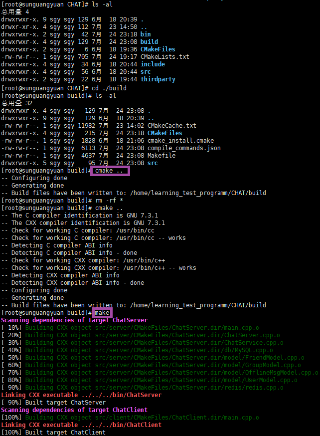

# ChatServer-based-on-NginxTcpLoadBalance-RedisPubSub
A cluster chat server based on Ngnix TCP load balancing and Redis publish subscriptions.


# 项目编译和安装：

## 编译：

使用CMakeLists.txt文件，在Linux上简单和可重复的方式来构建C++项目。

```shell
# 在项目根目录中创建一个名为 build 的目录，并在其中运行 CMake 工具。
su root 
#mkdir build
cd ./build
rm -rf *   # 删除上一次编译产生的build中的各种文件
cmake ..

# 在 build 目录中运行您生成的构建系统来构建项目
make
```



本项目，将上述操作写入了一个脚本文件`autobuild.sh`：

```shell
#!/bin/bash

# 打开了调试模式。当脚本执行时，每个命令都会打印出来。
set -x

rm -rf `pwd`/build/*
rm -rf `pwd`/bin/ChatServer `pwd`/bin/ChatClient
cd `pwd`/build &&
	cmake .. &&
	make
```

```shell
# 项目的编译过程简化为：
su root
./autobuild.sh
```

## 项目代码的运行：

前提需要先启动`redis`和`nginx`服务器，这里注意`nginx`和`redis`的配置文件修改。
最重要的是`nginx`配置文件中，配置负载均衡的ChatServer服务器集群中各个服务器的入口地址`ip:port`和负载均衡算法中选择每台服务器的权重`weight`。
本人在本项目中`/usr/local/nginx/conf/nginx.conf`的配置如下：
```shell
# nginx tcp loadbalance config
stream {
    upstream MyServer {
    	# nginx负载均衡器中，负载均衡算法需要更具weight权重来选择服务器
        server 127.0.0.1:6000 weight=1 max_fails=3 fail_timeout=30s;
        server 127.0.0.1:6002 weight=1 max_fails=3 fail_timeout=30s;
    }

    server {
        proxy_connect_timeout 1s;  # nginx作为负载均衡器，在指定时间内未与后端服务器集群建立连接，则判定连接失败
        
        # proxy_timeout 3s;        # nginx作为负载均衡器，与后端服务器保持连接的最长时间
        # 本项目中客户端通过nginx负载均衡器与后端服务器建立“长连接”，故不需要配置该参数项
        
        listen 8000;               # 客户端可通过该端口访问nginx负载均衡器
        proxy_pass MyServer;
        
        tcp_nodelay on;            # 禁用Nagle算法，从而允许立即发送小数据包，以获得更快的网络传输速度。这种设置在某些情况下可能会提高应用程序的性能，但在其他情况下可能会导致网络拥塞和其他问题，酌情配置。  
    }
}

# 注意：每次修改配置文件后，需要先`/usr/local/nginx/sbin/nginx -s stop`停止nginx服务并`cd /usr/local/nginx/sbin/nginx | ./nginx`重启，才能生效。
```

```shell
redis-server /myredis/redis.conf

cd /usr/local/nginx/sbin/
./nginx

# 查看redis和nginx、mysql是否已启动
netstat -antp
```


写了一个服务端`ChatServer.cpp`和客户端程序`ChatClient.cpp`，编译后会在`/bin`目录下生成两个可执行文件`ChatClient`和`ChatServer`，运行即可。


